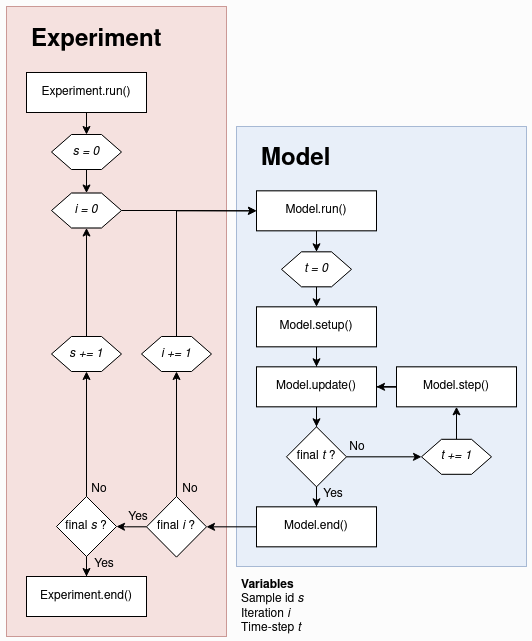

# Basic structure of AgentPy framework

1. The `Agent` : is the basic building block of a model.
2. The `Environment` : can be of 3 types -> Grid, Space and Network, they all contain `agents`.
3. The `Model` contains `agents`, `environments`, `parameters` and `simulation procedures`.
4. An `Experiment` can run a `model` multiple times with different parameter combinations.

All 4 options above can be considered as classes. And these classes are templates
that can be customized through the creation of sub-classes with their own variables
and methods.

# Model

The simulation procedures of a model are defined by four special methods that will be used *automatically* during different parts of a simulation.

1. `Model.setup` : is called at **the start** of the simulation (t == 0).
2. `Model.step` : is called **during** every time-step (excluding t == 0).
3. `Model.update` : is called **after** every time-step (including t== 0).
4. `Model.end` : is called at the end of the simulation.

An example of a basic model like this in action is [Wealth Transfer](../wealth_transfer/)

# Agent Sequences

The Sequences module provides containers for groups of agents.

The main classes are `AgentList`, `AgentDList` and `AgentSet`, which come with special methods to access and manipulate whole groups of agents.

For example, when the model in [custom_model.py](custom_model.py) calls its step() method, this executes `self.agents.agent_method` then it will call the method `MyAgentType.agent_method()` for every agent in the model. Similar commands can be used to *set and access variables*, or *select subsets of agents with boolean operators*.

The following command, for example, selects all agents with an id above one:

`agents.select(agents.id > 1)`

Take a look at [Virus Spread](../virus_spread/)

# Environments

Environments are objects in which agents can inhabit a specific position. A model can contain zero, one or multiple environments which agents can enter and leave.

The connections between positions is defined by the environment's topology.

There are currently three types:

1. `Grid` : n-dimensional spatial topology with discrete positions.
2. `Space` : n-dimensional spatial topology with continuous positions.
3. `Network` : graph topology consisting of `AgentNode` and `edges`.

- Applications of **networks** can be found in models like [Virus Spread](../virus_spread/) and [Button Network](../button_network/). 
- Applications of **spatial grids** in models like [Forest Fire](../forest_fire) and [Segregation](../segregation). 
- Applications of **continuous spaces** in models like [Flocking Behavior](../flocking_behavior).

- Note that there can also be models without environments like in [Wealth Transfer](../wealth_transfer/).

# Recording data

There are two ways to document data from the simulation for later analysis.

The first way is to record **dynamic variables**, which can be recorded for each object (agent, environment, or model) and time-step. They are useful to look at the dynamics of individual or aggregate objects over time and can be documented by calling the method `record()` for the respective object. Recorded variables can at run-time with the *object's log* attribute.

The second way is to **document reporters**, which represent summary statistics or evaluation measures of a simulation. In contrast to variables, reporters can be stored only for the model as a whole and only once per run. They will be stored in a separate dataframe for easy comparison over multiple runs, and can be documented with the method `Model.report()`. Reporters can be accessed at run-time via `Model.reporters`.

# Running a simulation

To perform a simulation, we initialize a new instance of our model type with a dictionary of parameters, amd then use the function `Model.run()`. This will return a `DataDict` with recorded data from the simulation. A simple run can be prepared and executed as follows:

```
parameters = {
     'my_parameter':42,
     'agents':10,
     'steps':10,
}

model = MyModel(parameters)
results = model.run()
```

A simulation proceeds as follows:

0. The model initializes with the time-step `Model.t = 0`
1. `Model.setup()` and `Model.update()` are called.
2. The model's time-step is increased by 1.
3. `Model.step()` and `Model.update()` are called.
4. Step 2 and 3 are repeated until the simulation is stopped.
5. `Model.end()` is called.

The simulation of a model can be **stopped** by one of the following two ways:

1. Calling the `Model.stop()` during the simulation.
2. Reaching the time-limit, which can be defined as follows:
- Defining `steps` in the parameter dictionary.
- Passing `steps` as an argument to `Model.run()`.

# Interactive simulations

Within a Jupyter Notebook, AgentPy models can be explored as an interactive simulation (similar to the traditional NetLogo interface) using ipysimulate and d3.js. For more information on this, please refer to [Interactive simulations](./interactive_simulations/README.md).

# Multi-run experiments

The **Parameter samples** module provides tools to create a **Sample** with multiple parameter *combinations from a dictionary of ranges*. Here is an example using **IntRange integer ranges**:

```
parameters = {
    'my_parameter': 42,
    'agents': ap.IntRange(10, 20),
    'steps': ap.IntRange(10, 20)
}

sample = ap.Sample(parameters, n=5)
```

The class `Experiment` can be used to run a model multiple times. As shown in the next figure, it will start with the first parameter combination in the sample and repeat the simulation for the amount of defined iterations. After that, the same cycle is repeated for the next parameter combination.



Here is an example of an experiment with the model defined above. In this experiment, we use a sample where one parameter is kept fixed, while the other two are varied 5 times from 10 to 20 and rounded to integer. Every possible combination is repeated 2 times, which results in 50 runs:

```
exp = ap.Experiment(MyModel, sample, iterations=2, record=True)
results = exp.run()
```

For more applied examples of experiments, check out the demonstration models [Virus spread](../virus_spread/), [Button network](../button_network/), and [Forest fire](../forest_fire/). An alternative to the built-in experiment class is to use AgentPy models with the EMA workbench (see [Exploratory modelling and analysis (EMA)](./exploratory_modelling_and_analysis_(EMA)/README.md)).

# Random Numbers

`Model` contains two random number generators:

1. `Model.random` is an instance of `random.Random`
2. `Model.nprandom` is an instance of `numpy.random.Generator`

The *random seed* for these generators can be set by defining a **parameter seed**. The Sample class has an argument randomize to control whether vary seeds over different parameter combinations. Similarly, Experiment also has an argument randomize to control whether to vary seeds over different iterations. More on this can be found in [Randomness and reproducibility](./randomness_and_reproducibility/README.md).

# Data analysis

Both `Model` and `Experiment` can be used to run a simulation, which will return a `DataDict` with output data. The output from the experiment defined above looks as follows:

```
>>>results
DataDict {
'info': Dictionary with 5 keys
'parameters':
    'constants': Dictionary with 1 key
    'sample': DataFrame with 2 variables and 25 rows
'variables':
    'MyAgent': DataFrame with 1 variable and 10500 rows
'reporters': DataFrame with 1 variable and 50 rows
}
```

All data is given in a `pandas.DataFrame` and formatted as `long-form data` that can easily be used with statistical packages like `seaborn`. The output can contain the following categories of data:

- `info` holds meta-data about the model and simulation performance.
- `parameters` holds the parameter values that have been used for the experiment.
- `variables` holds dynamic variables, which can be recorded at multiple time-steps.
- `reporters` holds evaluation measures that are documented only once per simulation.
- `sensitivity` holds calculated sensitivity measures.

The `DataDict` provides the following main methods to handle data:

- `DataDict.save()` and `DataDict.load()` can be used to store results.
- `DataDict.arrange()` generates custom combined dataframes.
- `DataDict.calc_sobol()` performs a Sobol sensitivity analysis.

# Visualization

In addition to the Interactive simulations, AgentPy provides the following functions for visualization:

- `animate()` generates an animation that can display output over time.
- `gridplot()` visualizes agent positions on a spatial Grid.
