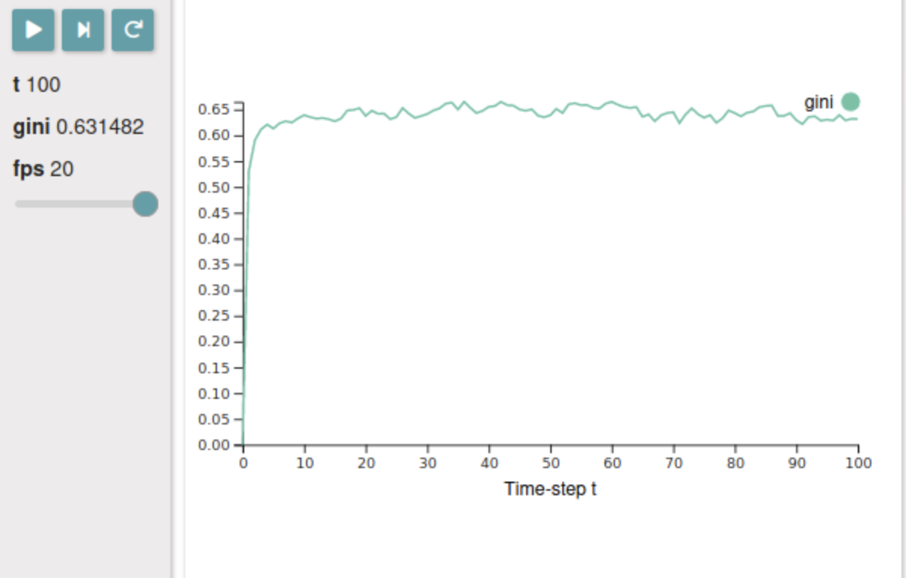
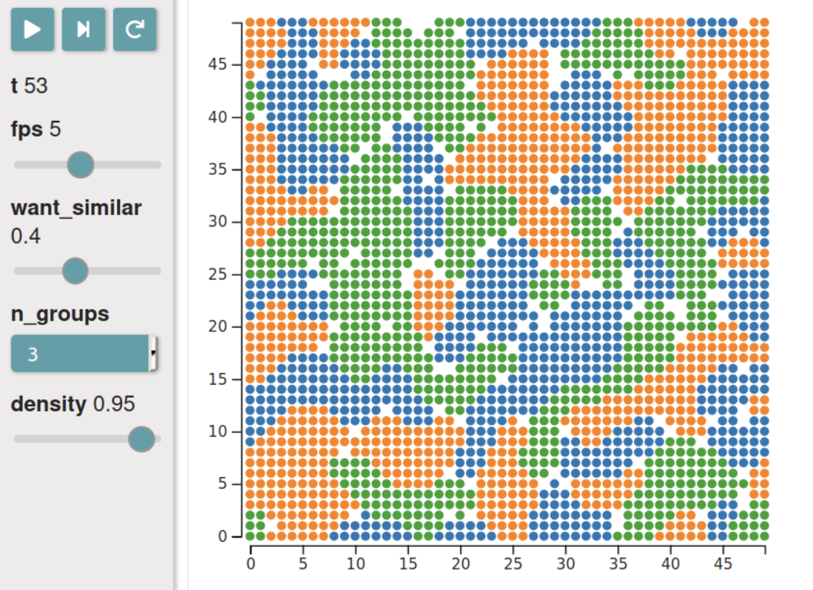

# Visualize the model dynamics

```python
# importing libraries
import agentpy as ap
import ipysimulate as ips

from ipywidgets import AppLayout
from agentpy.examples import WealthModel, SegregationModel
```

```python
model = WealthModel()
```

Parameters that are given as ranges will appear as interactive slider widgets. The parameter fps (frames per second) will be used automatically to indicate the speed of the simulation. The third value in the range defines the default position of the slider.

```python
parameters = {
    'agents': 1000,
    'steps': 100,
    'fps': ap.IntRange(1, 20, 5),
}
```

We then create an ipysimulate control panel with the model and our set of parameters. We further pass two variables t (time-steps) and gini to be displayed live during the simulation.

```python
control = ips.Control(model, parameters, variables=('t', 'gini'))
```

Next, we create a lineplot of the variable gini:

```python
lineplot = ips.Lineplot(control, 'gini')
```

Finally, we want to display our two widgets control and lineplot next to each other. For this, we can use the layout templates from ipywidgets.

```python
AppLayout(
    left_sidebar=control,
    center=lineplot,
    pane_widths=['125px', 1, 1],
    height='400px'
)
```




## Scatterplot

In this second demonstration, we create an instance of the segregation model:

```python
model = SegregationModel()
```

```python
parameters = {
    'fps': ap.IntRange(1, 10, 5),
    'want_similar': ap.Range(0, 1, 0.3),
    'n_groups': ap.Values(2, 3, 4),
    'density': ap.Range(0, 1, 0.95),
    'size': 50,
}
```

```python
control = ips.Control(model, parameters, ('t'))
scatterplot = ips.Scatterplot(
    control,
    xy=lambda m: m.grid.positions.values(),
    c=lambda m: m.agents.group
)
```

```python
AppLayout(left_sidebar=control,
          center=scatterplot,
          pane_widths=['125px', 1, 1],
          height='400px')
```

