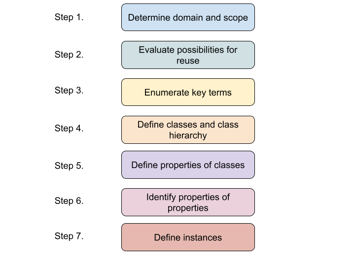

# Ontologies

### Methodology to build an Ontology

 😓 Questionario

1. ¿Cuál de los siguientes tiene una ontología que tiene propiedades con valor?

- Jerarquía Formal
- Restringido por lógica 
- **Restringido por valores**
- Ontología con propiedades

2. ¿Qué tipo de propiedad queda mejor para el siguiente ejemplo?

> contenido = {llantas, puertas, chasis, volante, asiento}

- de Relación
- Intrínseca 
- Extrínseca 
- **de Componente**

3. Una ontología es...

- **Un conjunto de conceptos en común compartido entre los agentes**
- Otra forma de crear código OOP
- Una estrategia de razonamiento para agentes 
- **Una definición formal de un conocimiento estructurado**
- **Una forma de representar el conocimiento**
- Un conjunto de clases que describe al ambiente

4. ¿Qué tipo de propiedad queda mejor para el siguiente ejemplo?

> cerca_de_objetivo($Agente_B$) = False

- Extrínseca 
- de Componente 
- Intrínseca 
- **de Relación**

5. ¿Qué tipo de propiedad queda mejor para el siguiente ejemplo?

> distancia_a_objetivo($Agente_B$) = 11

- de Componente
- de Relación 
- Instrínseca 
- **Extrínseca** 

6. ¿Cuál de los siguientes es una ontología que contienen grupos de clases que tienen la misma representación?

- **Thesaurus**
- Jerarquía Formal 
- Jerarquía Informal 
- Glosario

7. ¿Qué tipo de propiedad queda mejor para el siguiente ejemplo?

> fuel = 40.67

- de Relación
- **Intrínseca**
- Extrínseca
- de Componente

### References

[OWL2 - Structural Specification and Functional-Style Syntax](https://www.w3.org/TR/2012/REC-owl2-syntax-20121211/#Entities.2C_Literals.2C_and_Anonymous_Individuals)

[OWL2](https://www.w3.org/TR/2012/REC-owl2-overview-20121211/#)

[Protegé](https://protegewiki.stanford.edu/wiki/Main_Page) [2](https://protege.stanford.edu/)

[Tool to generate an ontology (OWL)](https://owlready2.readthedocs.io/en/v0.42/)

[Tool to manipulate Ontologies on Python](https://github.com/pwin/owlready2)