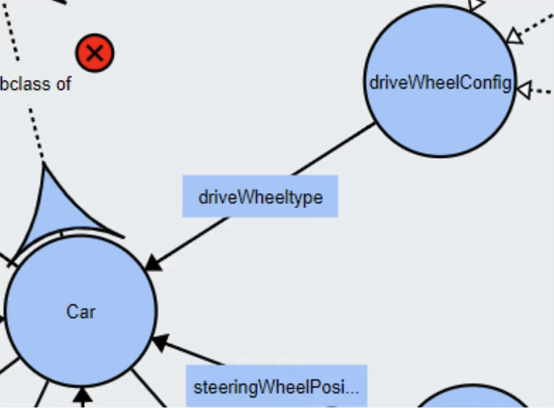

# OWL

### Web Ontology Language

The Web Ontology Language (OWL) is a semantic web lenguage designed to represent rich and complex knowledge about things, a group of things, and relations between things.

# Ontologies

Ontologies are described as a way of showing the properties of a subject area and how they are related, by defining a set of concepts and categories that represent the subject.

[CONCEPTS] <-> [RELATIONSHIPS] <-> [INSTANCES]

## Concepts

Concepts represent a set of classes or entities or things within a domain, which are used to classify individuals or other classes or a combination of both.

## Instances

Instances are used to refer to the things represented by the concept. It may include concrete objects such as people, animals, tables, or abstract individuals such as numbers and words.

## Relationship

Relationship specifies how objects are related to one another.

## Object Property

Object Property is used to link individuals to individuals.

## Data Property

Data Property can have datatype as the range and are used to link individuals to data values.

## VOWL

Visual Notation for OWL Ontologies

https://service.tib.eu/webvowl/

## Owlready

Owlready library allows us to work with OWL ontologies and reason with them in a Pythonic way.